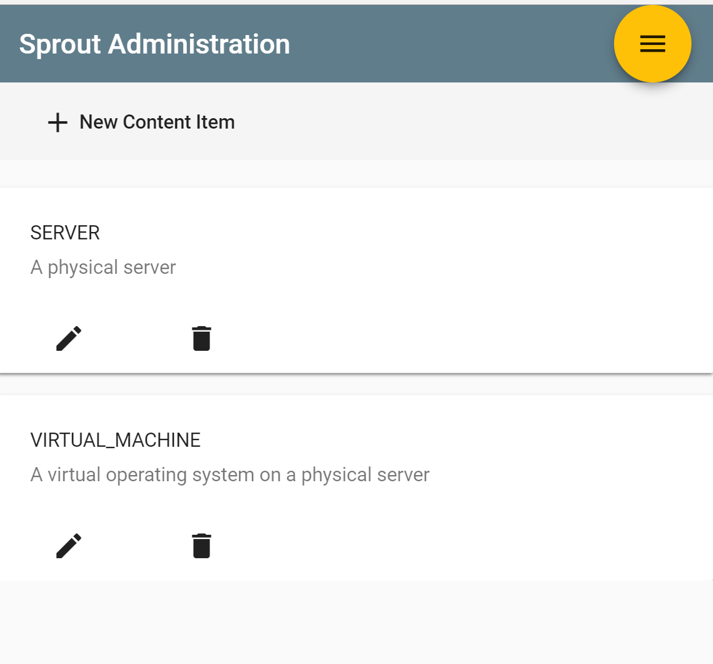

# Spot: Tinkerpop graph explorer built on the Sprout Platform  

[Sprout Platform](https://github.com/savantly-net/sprout-platform) 

Inspired by [GraphExp](https://bricaud.github.io/graphexp/)  


## Getting started  

To use Spot you can check out this project and run it -  
`mvn spring-boot:run`  
start the development front end - 
`npm start`  

Or build the project using the 'release' maven profile to package the front-end with the backend.  
  
  
## Configuration

Create a custom 'application.properties' file to configure your own Gremlin server, or just run the project to start the embedded version.  
See more here -> [application.properties](./src/main/resources/application.properties)  
And here -> [Spring Boot Configuration](https://docs.spring.io/spring-boot/docs/current/reference/html/boot-features-external-config.html#boot-features-external-config-application-property-files) 
  
## Admin 

Access the admin page at http://localhost:8080/admin/  

The default username and password are `admin` and `password`  

Manage which Labels are allowed for your nodes [vertices] and links [edges] using the administration pages [Content Items]  

  

  

  

  

  

  
  
## Additional Information  

### Installing a Gremlin server

If you have not yet installed a gremlin server, download the last release of the [Gremlin server](http://tinkerpop.apache.org/) and follow the [documentation](http://tinkerpop.apache.org/docs/current/reference/#gremlin-server). In the server folder just run
```
bin/gremlin-server.sh conf/gremlin-server-rest-modern.yaml
```
or on windows
```
bin/gremlin-server.bat conf/gremlin-server-rest-modern.yaml
```


### Graphexp guidelines
To display a node, type in a property name and value, then click on the search button. The input is case-sensitive.
Leaving a blank value will display a part of the graph limited to the first 50 nodes found (with their connections).
The node and edge properties can be automatically retrieved using the `get graph info` button. Pushing this button will also display some graph properties on the left side of the page.

When a node of the visualization is clicked, it will become 'active' with a circle surrounding it and its information will be display on the right side of the page. Moreover, this action will trigger the display of its neighbors.
Clicking on an edge will show its properties (without highlighting the edge). 

When appearing for the first time the nodes will be positioned following a force layout. Drag and drop can be used to pin them in a particular position. Once dragged the nodes will stay at their position. Drag and drop is allowed only for the nodes on the active layer (most recent layer) with no connection with nodes in other layers. See "Visualization concepts" section for more information on the layers.

## Visualization concept [GraphExp]  

The visualization is based on a concept of layers of visualization. The idea is to progress in the graph as in a jungle. The clicked node immediately shows its neighbors, opening new paths for the exploration. If not clicked, a node vanishes little by little as we progress in the exploration. Coming back during the exploration is allowed. Before it completely disappears, a node can be clicked and will become active again.
This visualization concept is aimed at providing a precise, local view rather than a global one.

During your exploration, you can set up milestones by clicking on the small circle on the upper right side of a node. This will pin the node in time, preventing it from disappearing.

You may also freeze the exploration, by ticking the appropriate checkbox. The evolution of the exploration will stop, allowing to gather information on the nodes displayed, without displaying their neighbors.


## Program description

The program uses:
* the D3.js library to visualize a graph in an interactive manner, [API Reference](https://github.com/d3/d3/blob/master/API.md),
* @savantly/gemlin-js Simple gremlin client for the browser [Github project](https://github.com/savantly-net/gremlin-js)  
* @savantly/ngx-graphexp Angular plugin for exploring a graph  [Github Project](https://github.com/savantly-net/ngx-graphexp)  
  
